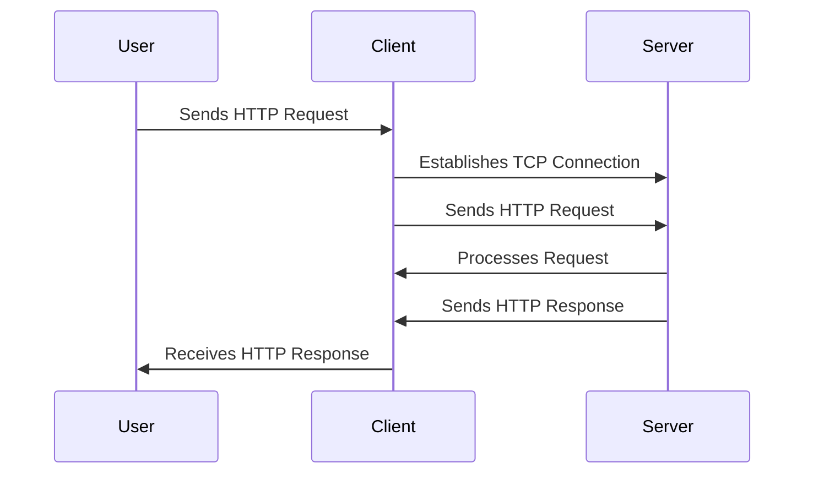

# Ex9

```mermaid
sequenceDiagram
    participant User
    participant Client
    participant Server

    User->>Client: Sends HTTP Request
    Client->>Server: Establishes TCP Connection
    Client->>Server: Sends HTTP Request
    Server->>Client: Processes Request
    Server->>Client: Sends HTTP Response
    Client->>User: Receives HTTP Response
```
