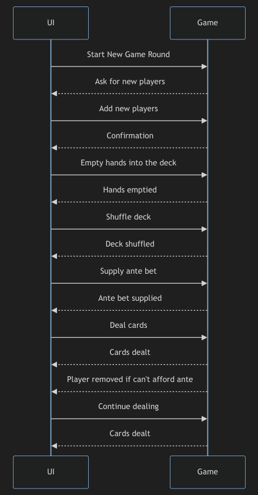

# Unit- 2 - Week 3

```cpp
#include <iostream>
#include <cstring>
using namespace std;

// Ex1
class Box
{
private:
    double length;
    double breadth;
    double height;

public:
    Box()
    {
        length = 0;
        breadth = 0;
        height = 0;
    }

    Box(double l, double b, double h)
    {
        length = l;
        breadth = b;
        height = h;
    }

    void setDimensions(double l, double b, double h)
    {
        length = l;
        breadth = b;
        height = h;
    }

    double calculateVolume()
    {
        return length * breadth * height;
    }
};

// Ex2
class Point
{
private:
    double x;
    double y;

public:
    Point(double x_val, double y_val)
    {
        x = x_val;
        y = y_val;
    }

    double getX()
    {
        return x;
    }

    double getY()
    {
        return y;
    }
};

class Circle
{
private:
    Point center;
    double radius;

public:
    Circle(Point center_val, double radius_val) : center(center_val)
    {
        radius = radius_val;
    }

    void display()
    {
        cout << "Center = (" << center.getX() << ", " << center.getY() << ")" << endl;
        cout << "Radius = " << radius << endl;
    }
};

// Ex3
class Student
{
private:
    char *name;
    int rollNumber;
    double feesPaid;

public:
    Student(const char *name_val, int roll_val, double fees_val)
    {
        name = new char[strlen(name_val) + 1];
        strcpy(name, name_val);
        rollNumber = roll_val;
        feesPaid = fees_val;
    }

    Student(const Student &source)
    {
        name = new char[strlen(source.name) + 1];
        strcpy(name, source.name);
        rollNumber = source.rollNumber;
        feesPaid = source.feesPaid;
    }

    ~Student()
    {
        delete[] name;
    }

    void display()
    {
        cout << "Name = " << name << endl;
        cout << "Roll Number = " << rollNumber << endl;
        cout << "Fees Paid = " << feesPaid << endl;
    }
};

// Ex4
class Book
{
private:
    char *ISBN;
    char *title;
    char *author;

public:
    Book() : ISBN(nullptr), title(nullptr), author(nullptr) {}

    Book(const char *ISBN_val, const char *title_val, const char *author_val)
    {
        ISBN = new char[strlen(ISBN_val) + 1];
        strcpy(ISBN, ISBN_val);

        title = new char[strlen(title_val) + 1];
        strcpy(title, title_val);

        author = new char[strlen(author_val) + 1];
        strcpy(author, author_val);
    }

    ~Book()
    {
        delete[] ISBN;
        delete[] title;
        delete[] author;
    }

    void display() const
    {
        cout << "ISBN = " << ISBN << endl;
        cout << "Title = " << title << endl;
        cout << "Author = " << author << endl;
    }
};

class LibraryMember
{
private:
    int memberID;
    char *name;
    char *contactDetails;

public:
    LibraryMember() : memberID(0), name(nullptr), contactDetails(nullptr) {}

    LibraryMember(int memberID_val, const char *name_val, const char *contact_val)
    {
        memberID = memberID_val;

        name = new char[strlen(name_val) + 1];
        strcpy(name, name_val);

        contactDetails = new char[strlen(contact_val) + 1];
        strcpy(contactDetails, contact_val);
    }

    ~LibraryMember()
    {
        delete[] name;
        delete[] contactDetails;
    }

    void display() const
    {
        cout << "Member ID = " << memberID << endl;
        cout << "Name = " << name << endl;
        cout << "Contact Details = " << contactDetails << endl;
    }
};

// Ex5
class Complex
{
private:
    float real;
    float imag;

public:
    Complex() : real(0), imag(0) {}

    Complex(float r, float i) : real(r), imag(i) {}

    Complex add(const Complex &c)
    {
        return Complex(real + c.real, imag + c.imag);
    }

    Complex subtract(const Complex &c)
    {
        return Complex(real - c.real, imag - c.imag);
    }

    Complex multiply(const Complex &c)
    {
        float r = real * c.real - imag * c.imag;
        float i = real * c.imag + imag * c.real;
        return Complex(r, i);
    }

    Complex divide(const Complex &c)
    {
        float denominator = c.real * c.real + c.imag * c.imag;
        float r = (real * c.real + imag * c.imag) / denominator;
        float i = (imag * c.real - real * c.imag) / denominator;
        return Complex(r, i);
    }

    void display() const
    {
        cout << real << " + " << imag << "i";
    }
};

// Ex6
class State
{
private:
    string name;
    double area;
    double population;

public:
    State() : name(""), area(0.0), population(0.0) {}

    State(const string &name_val, double area_val, double population_val)
        : name(name_val), area(area_val), population(population_val) {}

    State(const string &name_val) : name(name_val), area(0.0), population(0.0) {}

    void setArea(double area_val)
    {
        area = area_val;
    }

    void setPopulation(double population_val)
    {
        population = population_val;
    }

    double getArea() const
    {
        return area;
    }

    double getPopulation() const
    {
        return population;
    }

    void display() const
    {
        cout << "State = " << name << endl;
        cout << "Area = " << area << " sq km" << endl;
        cout << "Population = " << population << " million" << endl;
    }
};

// Ex7
class DynamicArray
{
private:
    int *array;
    int size;

public:
    DynamicArray(int array_size) : size(array_size)
    {
        array = new int[size];
        cout << "Dynamic array of size " << size << " created." << endl;
    }

    ~DynamicArray()
    {
        delete[] array;
        cout << "Dynamic array memory released." << endl;
    }

    void display()
    {
        cout << "Dynamic array elements =" << endl;
        for (int i = 0; i < size; ++i)
        {
            cout << array[i] << " ";
        }
        cout << endl;
    }
};

int main()
{
    // Ex1
    double l, b, h;

    cout << "Enter length = ";
    cin >> l;
    cout << "Enter breadth = ";
    cin >> b;
    cout << "Enter height = ";
    cin >> h;

    Box box1(l, b, h);

    double volume = box1.calculateVolume();

    cout << "Volume of the box = " << volume << endl;

    // Ex2
    double x, y, r;
    cout << "Enter x-coordinate of center = ";
    cin >> x;
    cout << "Enter y-coordinate of center = ";
    cin >> y;
    cout << "Enter radius = ";
    cin >> r;

    Point center(x, y);

    Circle circle(center, r);

    circle.display();

    // Ex3
    const char *name1 = "John Doe";
    int rollNumber1 = 101;
    double feesPaid1 = 5000.0;

    Student student1(name1, rollNumber1, feesPaid1);

    cout << "Details of First Student =" << endl;
    student1.display();
    cout << endl;

    Student student2 = student1;

    cout << "Details of Second Student (Copied from First Student) =" << endl;
    student2.display();

    // Ex4
    Book book1("978-3-16-148410-0", "The Great Gatsby", "F. Scott Fitzgerald");

    cout << "Book Details =" << endl;
    book1.display();
    cout << endl;

    LibraryMember member1(1001, "John Doe", "john.doe@example.com");

    cout << "Library Member Details =" << endl;
    member1.display();

    // Ex5
    Complex c1(3, 2);
    Complex c2(1, 4);

    Complex addition = c1.add(c2);
    Complex subtraction = c1.subtract(c2);
    Complex multiplication = c1.multiply(c2);
    Complex division = c1.divide(c2);

    cout << "Addition = ";
    addition.display();
    cout << endl;

    cout << "Subtraction = ";
    subtraction.display();
    cout << endl;

    cout << "Multiplication = ";
    multiplication.display();
    cout << endl;

    cout << "Division = ";
    division.display();
    cout << endl;

    // Ex6
    State tamilnadu("Tamil Nadu", 130, 80);
    State karnataka("Karnataka", 191, 65);
    State kerala("Kerala");
    kerala.setArea(38);
    kerala.setPopulation(34);

    cout << "State Information =" << endl;
    tamilnadu.display();
    cout << endl;
    karnataka.display();
    cout << endl;
    kerala.display();

    // Ex7
    DynamicArray dyn_array(5);
    dyn_array.display();

    return 0;
}
```

## Ex8


